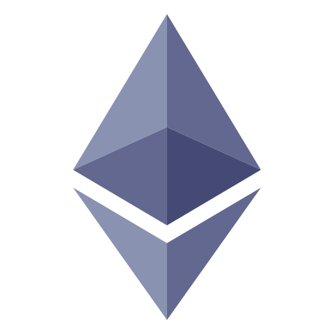
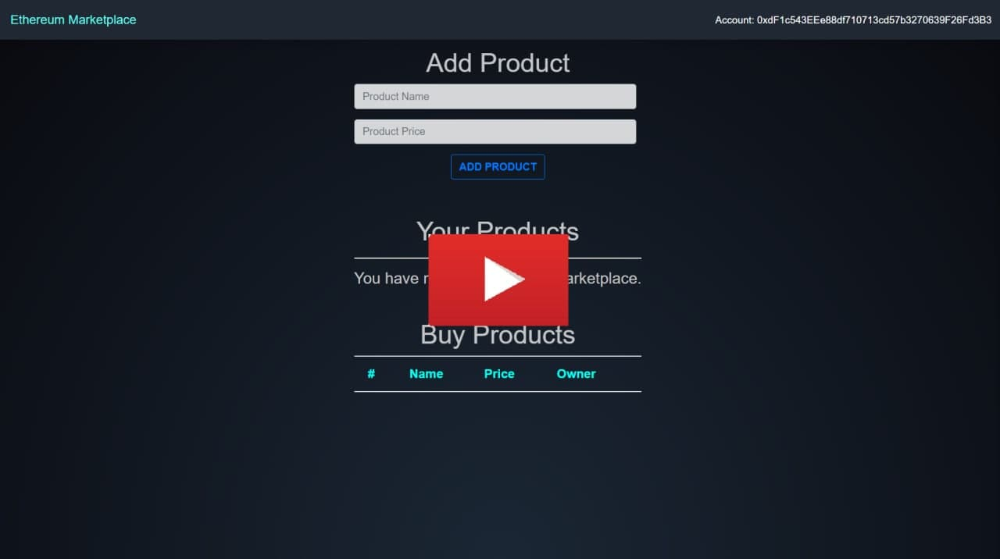

 
<!--  -->

  
  

  <h2 align="center">Ethereum Marketplace</h2>

  

    An E-commerce Blockchain Application.
   
  

 

# Ethereum Marketplace

### About this file:
### The goal of this readme file is to give you an overview, features of the application and directions for running it on your local machine.  
   

# Overview
### Blockchain is a means of storing data that makes it difficult or impossible to change, hack, or defraud the system. The blockchain technology is becoming increasingly popular, and is the main component of this application.

### This is a small-scale eCommerce website where one can create merchandise and sell them at their will. A video about running the application is also added below.
 

# Features
* View your account details on the platform using Metamask.
* Create products for any price range on the platform.
* Using your crptocurrency, you can purchase a variety of items.
* Each user gets their own cart where they may view their purchases.
* You can also make your products unavailable for others to purchase.
* Seemless reload during transaction of the products and during account change. 
* Implemented smooth and snappy UI transitions.
 
 

# How to run it on your local machine

* Download or clone these files to your local machine.
* Run `npm install -g truffle@5.0.5`
* Run `npm i`
* Setup your blockchain on ganache and create a workspace.
* Add `truffle-config.js` file (located in the repo) to workspace and save it.
* Setup the metamask extension on your favourite browser.
* Connect your local blockchain to metamask.
* Run `truffle migrate`
* Run `npm start`
* That's it !!! Explore the application. Hope you like it.

 

## In case you stuck in above instructions, you can watch this video for in-depth directions.
 

 

 
 

# Software used:
           

# ✏ Contributing

Feel free to dive in! [Open an issue](https://github.com/pavan-k-teja/ethereum-marketplace/issues/new) or submit PRs.

